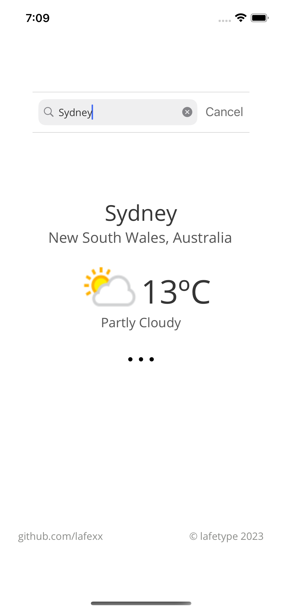

# Cyclone 🌀 
Cyclone is a cross-platform weather app developed in C# using .NET Maui. 

## Features 
- Accurate real-time weather from millions of locations around the world
- Basic and advanced weather information.
- Cross Platform
- Responsive Design

 
